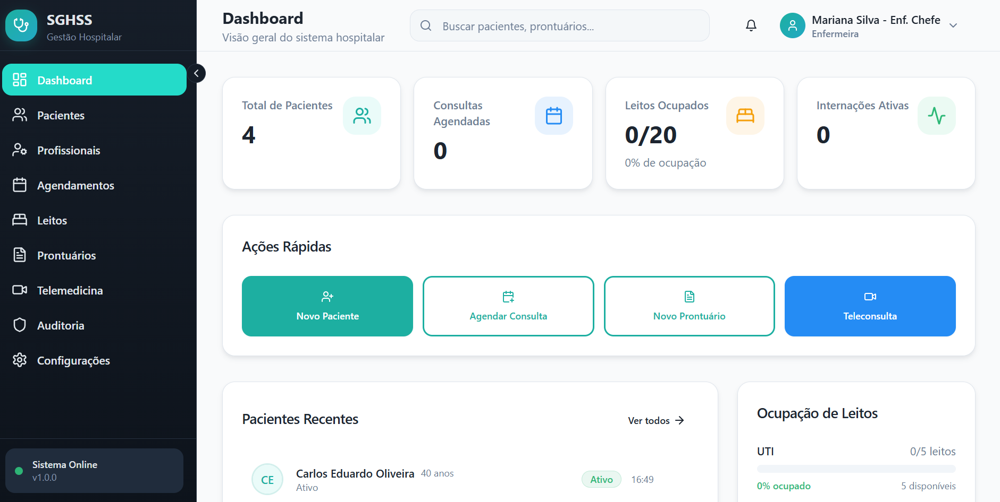

# MedCore - Sistema de Gestão Hospitalar e de Serviços de Saúde (SGHSS)

## Sobre o Projeto

O **MedCore** é um Sistema de Gestão Hospitalar e de Serviços de Saúde (SGHSS) desenvolvido como projeto de conclusão do curso de tecnólogo em Análise e Desenvolvimento de Sistemas pela UNINTER. O projeto foi baseado no estudo de caso da instituição fictícia "VidaPlus", que necessitava de uma solução integrada para administrar suas operações, incluindo hospitais, clínicas, laboratórios e serviços de home care.

A plataforma visa centralizar e otimizar a gestão de informações de pacientes, profissionais de saúde e processos administrativos, garantindo segurança, escalabilidade e alta disponibilidade, em conformidade com a Lei Geral de Proteção de Dados (LGPD).


## Acesso ao Projeto

Você pode acessar a versão ao vivo do projeto clicando no link abaixo:

**[Acessar MedCore](https://medcore-sghss.vercel.app)**


## Índice

- [Sobre o Projeto](#sobre-o-projeto)
- [Acesso ao Projeto](#acesso-ao-projeto)
- [Principais Funcionalidades](#principais-funcionalidades)
- [Tecnologias Utilizadas](#tecnologias-utilizadas)
- [Estrutura do Projeto](#estrutura-do-projeto)
- [Como Executar o Projeto](#como-executar-o-projeto)
- [Telas da Aplicação](#telas-da-aplicação)
- [Autor](#autor)
- [Licença](#licença)


## Principais Funcionalidades

O sistema foi projetado para atender a diferentes perfis de usuários (médicos, enfermeiros e administradores) com os seguintes módulos principais:

- **Gestão de Pacientes:** Cadastro completo, acesso ao histórico clínico, agendamento e cancelamento de consultas e recebimento de notificações.
- **Gestão de Profissionais de Saúde:** Gerenciamento de agendas, atualização de prontuários e acompanhamento do histórico dos pacientes.
- **Administração Hospitalar:** Controle de cadastros, gestão do fluxo de internações e gerenciamento de leitos.
- **Telemedicina:** Realização de videochamadas seguras para consultas online, registro de prontuários e emissão de prescrições eletrônicas.
- **Segurança e Compliance:** Controle de acesso baseado em perfis, criptografia de dados sensíveis, registros de logs para auditoria e conformidade total com a LGPD.


## Tecnologias Utilizadas

O projeto foi construído utilizando um stack moderno de tecnologias para garantir uma experiência de usuário fluida, um desenvolvimento ágil e uma arquitetura robusta.

| Categoria | Tecnologia | Descrição |
| :--- | :--- | :--- |
| **Frontend** | React 18.3.1 | Biblioteca para construção de interfaces de usuário. |
| | TypeScript 5.8.3 | Superset do JavaScript que adiciona tipagem estática. |
| | Vite | Ferramenta de build e desenvolvimento frontend de alta performance. |
| | Tailwind CSS | Framework CSS utility-first para estilização rápida. |
| | Shadcn/ui (Radix UI) | Coleção de componentes de UI acessíveis e customizáveis. |
| **Backend & Banco de Dados** | Supabase | Plataforma Backend as a Service (BaaS) com banco de dados PostgreSQL. |
| **Roteamento** | React Router DOM | Biblioteca para gerenciamento de rotas na aplicação. |
| **Gerenciamento de Estado**| TanStack React Query | Gerenciamento de estado assíncrono, cache e sincronização de dados. |
| **Formulários** | React Hook Form & Zod | Para construção e validação de formulários. |
| **Visualização de Dados** | Recharts | Biblioteca de gráficos para React. |
| **Outras Ferramentas** | Lucide React, date-fns, Sonner | Ícones, manipulação de datas e notificações. |


## Estrutura do Projeto

O código-fonte está organizado da seguinte maneira para facilitar a manutenção e escalabilidade:

```

/src
|-- /assets/          # Imagens, fontes e outros recursos estáticos
|-- /components/      # Componentes React reutilizáveis (UI, layout, etc.)
|-- /contexts/        # Contextos React para gerenciamento de estado global
|-- /hooks/           # Hooks customizados
|-- /integrations/    # Módulos de integração com serviços externos (ex: Supabase)
|-- /lib/             # Funções e utilitários gerais
|-- /pages/           # Componentes que representam as páginas da aplicação
|-- App.tsx           # Componente raiz da aplicação e configuração de rotas
|-- main.tsx          # Ponto de entrada da aplicação

```

## Como Executar o Projeto

Para executar o projeto localmente, siga os passos abaixo:

1.  **Clone o repositório:**
    ```bash
    git clone https://github.com/layzealves/MedCore.git
    ```

2.  **Navegue até o diretório do projeto:**
    ```bash
    cd MedCore
    ```

3.  **Instale as dependências:**
    ```bash
    npm install
    ```

4.  **Configure as variáveis de ambiente:**
    - Renomeie o arquivo `.env-example` para `.env`.
    - Insira as chaves de API do seu projeto Supabase no arquivo `.env`.

5.  **Execute o servidor de desenvolvimento:**
    ```bash
    npm run dev
    ```

A aplicação estará disponível em `http://localhost:5173`.


## Telas da Aplicação


_Tela de Login_


_Dashboard_


## Autor

- **Layze Alves** - [GitHub](https://github.com/layzealves)


## Licença

Este projeto está sob a licença MIT. Veja o arquivo [LICENSE](LICENSE.md) para mais detalhes.

